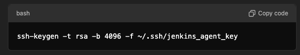

# Jenkins Docker Compose Setup Guide for AdventureTube Project!

Managing the micro-service modules that include building source code, creating Docker images, and running tests can be a tedious task. 
This process must be performed not only locally but also on remote production or integration test servers, making it prone to human error and time-consuming. 
Automating the build process using Jenkins CI/CD  is essential.

While the initial setup may take some time, it will ultimately result in greater efficiency throughout the project.

## 1. Bird of View of Adventuretube jenkins 
Before diving into each separate section, here's an overview of **how the Jenkins master/agent setup looks**

 

Thre is three seprate tasks in order to finalize update process to rasberry-pi server.
>1. After the finished local test Source code from developer will heading to the Git  
>2. This will causing a update notification to jenkins controller that will become chain reaction to jenkins agent to pull the new souce and 'compile/build/test' on it's own independent docker environment 
>3. Eventurally build new image and publish to the actual service in Rasberry-pi server as end of build pipeline.

## 2. Key Concepts for the AdventureTube Build Pipeline
As shown in the diagram, there are three main components to work with for the AdventureTube build pipeline:

#### 1. Jenkins Master/Agent Running Inside Docker Compose
      

**Why you shoud consider Jenkins master/ agent**

If I want to run Jenkins for various testing conditions in a completely isolated environment 
and destroy the container after each Jenkins execution, *The master will only handle orchestration*.
This guarantees job performance and clear separation.

Most importantly, **it provides me with complete toolset configuration freedom**—yes,
you can do whatever you want without worrying about contaminating other environments.
I can't express enough how convenient this will be for future automation in CI/CD pipelines.

**Using Docker compose is better**

Docker Compose allows easy management and deployment of both the master and agent. 
Since I have separate Dockerfiles for each component (master and agent), 
the separation of the agent container from the controller on a physical level will be much easier! 
Docker Compose will help define the volumes, networks,
and dependencies needed for Jenkins to function across your setup, 
ensuring smooth operations and deployment.

#### 2.  SSH connection (total 4 different direction in AdvnetureTube)
**Basic concept of SSH Connection**

Before explain seeting of  ssh in Adventureutube let's have a look basic concept of ssh.

When establishing an SSH connection, there are few  concept need to be understand :
> ###### Key Pair 
> * The private key is kept secure on the client machine and must never leave it
> * The public key is shared and placed on the the remote server you want to connect to in the ~/.ssh/known_hosts

> ###### Identification 
> 
> *  Server's identification 
When the client attempts to connect to the server, the server sends its public key from "authorized_keys" to the client.
If the client has never connected to this server before, the client will be prompted to register the server's public key in the "known_hosts" file.
> * Client's identification 
Once the server is identified, the server issues a challenge to the client.
The client must sign this challenge using its private key and send the signed response back to the server.
The server then verifies the response using the client’s public key, which is stored in the server’s authorized_keys file.
and that is way to establishing ssh connection.

> ###### HostkeyVerification 
>  * Detail will be discussed agin in the "Configuration detail again"

There is additional condition that neeed to be concidered for Adventuretube which is 
both jenkins master and agent are running on docker using a docker compose file
and that is why we going to setup with existing key pair by 
   > put the public key in jenkins-agent enviroment value
   > copy key pair to  jenkins master docker image  

**Jenkins mater with agent.**

SSH will be used for secure connections between the Jenkins master and agents. 
I've used pre-made SSH keys (jenkins_agents_key) and ensured they are properly set up 
in the Jenkins configuration for SSH-based communication. 

Normally Jenkins agents can authenticate using SSH keys to the master for 
secure and passwordless connections, which is "Launch agent by connecting it to the controller" Option. 

But it will be opposite in our case since we will use "Launch agents via SSH"!!!!
*Why???? becuase this option give contoller full controll of agent* , 
so contoller will be able to luanch agent and remove it when its not needed cool!!.

This is such different concept and make such different process,Since jenkins controller will initiate 
the connection process,   Now , *controller become ssh client and agent will ssh server*. 

During the configuration of **"Launch agents vis SSH"**
You will need to understand the concept of  **"Host Key Verification Strategy"** 
This setting will only apply connection between master with agent 

There is one more place that "Host Key Verification Strategy" setting exit which in 
Jenkins "Security" menu  that is apply to entire jenkins master.

Detail will be discussed agin in the "Configuration detail again"

But wait a moment! 

*Theoretically, I don’t need to create an SSH channel between the master and agent 
since they already have good isolation through the Docker Compose network*.
This unintentional secure environment is possible only because
I’m currently running both the master and the agent on the same physical machine. 

However, this structure will *become an issue if I want to scale the agent container in the future*.

**3 more diffrent connection to Git**
- jenkins master with Git.
- jenkins slave with Git.   
- developer local  with Git.

These connection are used all same key pair  but just heading a different direction.

#### 3. SSL configuration 

SSL (HTTPS Setup): 
Since I’ve mapped port 8443 for HTTPS in Docker Compose, 
Jenkins needs to be configured with SSL certificates. 
I will either provide a self-signed certificate or obtain one from a certificate authority. 
(In my case, I will set up an Nginx proxy server and create the certificates.) 
After setting it up, make sure Jenkins is properly configured to point to these certificates.

## 3.  Configuration Details in Action

#### 1. SSL configuration  
In Jenkins, when configuring SSL, you typically need to handle two main components. 

**SSL certrification Configuration : Two different way**
 1. Using a nginx proxy server   as reverse Proxy. and This is what i use in AdventureTube 
 2. self-signed certificates to the java keystore :       
[How to enable ssl in jenkins without docker](https://www.baeldung.com/ops/jenkins-enable-https)

**port Configuration**

To enable HTTPS on Jenkins Master, set the following environment variable in your Docker Compose file:

> ENV JENKINS_OPTS --httpPort=-1 --httpsPort=8443 --httpsKeyStore="/var/jenkins_home/.ssl/keystore.jks" --httpsKeyStorePassword="5785ch00"

This will allow access through port 8443 while disabling HTTP for security reasons.

#### 2. SSH Connection in Jenkins : 

As I mentionedf before there will be two seperate ssh connection for jenkins in my AdventureTube Project ATM.

**1. Controller-Agent Connection**
This allows the Jenkins controller (master) to securely communicate with the agent over SSH. 
The controller orchestrates the build and deploy processes, while the agent handles actual execution, 
like testing and building.

In my AdventureTube project ,Jenkins Master will initiate the connection (become a ssh client )
and agent will receive connection (become a ssh server).
So private key (jenkins-agent-key) will be added in Credential in jenkins master 
and public key will be passed as a enviroment value in docker compose file for jenkin-agent

Step1).Generate an SSH key pair and register for both master and agent  (reference : https://www.jenkins.io/doc/book/using/using-agents/)

Name the private key jenkins_agent_key.
Register the private key in Jenkins Master as a credentialfor controller .
Set the public key as an environment variable in your Docker Compose file for agent .
During agent container creation, this public key will be added to the known_hosts file.

Note: Ensure the private key has an extra carriage return at the end when uploaded to GitHub.

Step2) New node setting

 

* root directory : /home/jenkins/agent
* Launch method : Launch agents via SSH and  this will make jenkins master as ssh client and  jenkins agent as ssh server
             as connection will  initiate from jenkins master and agent will be created.

* Host : localhost or ipaddress

* HostkeyVerification Stratagy 
option 1) None verifying verification Stratagy  => nothing to do but not secure!!!
option 2) Known host verification Stratagy => generate known_hosts on jenkins master  using ssh-keyscan will add the the agents's public key 

change file permission to jenkins after create file,This way Jenkins master can securely connect to the agent without manual prompts or password authentication.
option 3) Manually trusted key Verification Stratagy 

**2. Git Repository Connection** 
The agent or master needs a second SSH connection to access  Git repository.
When code is pushed to Git, Jenkins receives a notification (via a webhook), 
and the agent initiates the process of pulling the code from the repository for testing, building, and deployment.

Use the id_ed25519 private key for communication with GitHub.
Make sure this key is available on both Jenkins Agent and Master.
Be cautious about any missing carriage returns in the private key content to prevent authorization errors.

SSH connection between master / agent /github 

1) Docker in Docker Issue on Jenkins Agent

Jenkins Agent may encounter permission issues when accessing /var/run/docker.sock.
Although the Dockerfile for Jenkins Agent adds the Jenkins user to the Docker group within the agent container, 
it doesn't affect the Docker group on the host machine.

To resolve this, you can follow these steps:
(Fith solution in https://phoenixnap.com/kb/docker-permission-denied) 
Edit the Docker service file by running: sudo nano /usr/lib/systemd/system/docker.service
Append the following lines to the bottom of the Service section:

SupplementaryGroups=docker
ExecStartPost=/bin/chmod 666 /var/run/docker.sock

Restart the Docker service: sudo service docker restart
Note: Changing permissions to 666 for /var/run/docker.sock is not recommended for security reasons, so the provided solution is a safer alternative.

By following these instructions, you should be able to set up Jenkins with Docker Compose and resolve common SSH and Docker-related issues.

