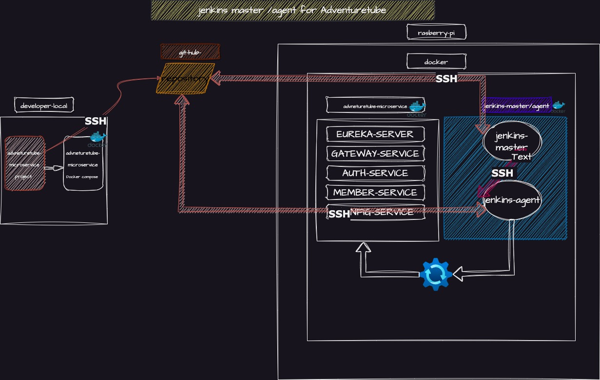
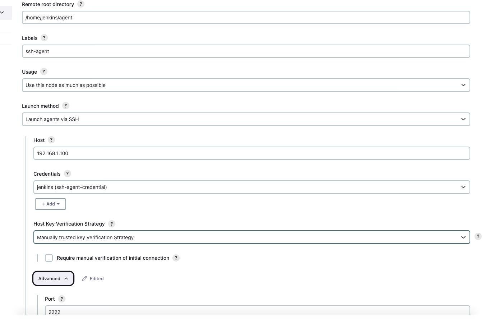
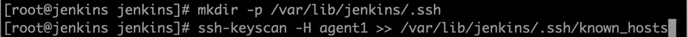

# jenkins-docker-compose

Jenkins Docker Compose Setup Guide for AdventureTube Project!

Managing the microservice modules that include building source code, creating Docker images, and running tests can be a tedious task. This process must be performed not only locally but also on remote production or integration test servers, making it prone to human error and time-consuming. Automating the build process using Jenkins CI/CD is essential.

While the initial setup may require a significant amount of time, it will ultimately yield far greater efficiency and results throughout the project. 

There will be total 4 different ssh connection.

     1. developer loccal  with Git.
     2. jenkins master with Git.
     3. jenkins slave with Git.
          
     4. jenkins mater with agent.

  *  4 main aspects needed to consider to build proper jenkins environment:
   
     1. SSL (HTTPS Setup): 
         Since I’ve mapped port 8443 for HTTPS in Docker Compose, Jenkins needs to be configured with SSL certificates. 
         I will either provide a self-signed certificate or obtain one from a certificate authority. 
         (In my case, I will set up an Nginx proxy server and create the certificates.) 
         After setting it up, make sure Jenkins is properly configured to point to these certificates.

         Actual configuration is in below 

     2. SSH Connection in jenkins : 
      1) Between Controller with Agent
        SSH will be used for secure connections between the Jenkins master and agents. 
        I've used pre-made SSH keys (strider_jenkins_key) and ensured they are properly set up in the Jenkins configuration for SSH-based communication. 
        Jenkins agents can authenticate using SSH keys to the master for secure and passwordless connections. 
        You’ll need to set the correct SSH key in Jenkins when setting up the agent node.

        But wait a moment! 
        Theoretically, I don’t need to create an SSH channel between the master and agent since they already have good isolation through the Docker Compose network.
        This unintentional secure environment is possible only because I’m currently running both the master and the agent on the same physical machine. 
        
        However, this structure will become an issue if I want to scale the agent container in the future.
      2) Possible other ssh connection in jenkins 
          - connection to git hub to pulling the source (applied in my configuration)
          - connection to AWS to deploy (not yet)

     3. Master-Agent Mode: 
        If I want to run Jenkins for various testing conditions in a completely isolated environment and destroy the container after each Jenkins execution, 
        the master will only handle orchestration. This guarantees job performance and clear separation.

        Most importantly, it provides me with complete toolset configuration freedom—yes, you can do whatever you want without worrying about contaminating other environments.
        I can't express enough how convenient this will be for future automation in CI/CD pipelines.

     4. Using Docker Compose: 
        Docker Compose allows easy management and deployment of both the master and agent. 
        Since I have separate Dockerfiles for each component (master and agent), 
        the separation of the agent container from the controller on a physical level will be much easier! 
        Docker Compose will help define the volumes, networks, and dependencies needed for Jenkins to function across your setup, ensuring smooth operations and deployment.

    * Actual Configuration 

       
    1. SSL configuration  
          In Jenkins, when configuring SSL, you typically need to handle two main components.
          
            1) SSL certrification Configuration : Two different way 
                  
                  Using a nginx proxy server   as reverse Proxy. and This is what i use in AdventureTube 
                
                  self-signed certificates to the java keystore :       
                  How to enable ssl in jenkins (without docker) https://www.baeldung.com/ops/jenkins-enable-https

                     Place the keystore.jks file inside the .ssh directory.
                     To enable HTTPS on Jenkins Master, set the following environment variable in your Docker Compose file:
                   
                     ENV JENKINS_OPTS --httpPort=-1 --httpsPort=8443 --httpsKeyStore="/var/jenkins_home/.ssl/keystore.jks" --httpsKeyStorePassword="5785ch00"
  
                     This will allow access through port 8443 while disabling HTTP for security reasons.

            2) port Configuration 

    2. SSH Connection in Jenkins : 
            
          There will be two seperate ssh connection for jenkins in my AdventureTube Project ATM.

           1) Controller-Agent Connection: 
               This allows the Jenkins controller (master) to securely communicate with the agent over SSH. 
               The controller orchestrates the build and deploy processes, while the agent handles actual execution, 
               like testing and building.

               In my AdventureTube project  Jenkins Master will initiate the connection (become a ssh client )
               and agent will receive connection (become a ssh server).
               So private key (jenkins-agent-key) will be added in Credential in jenkins master 
               and public key will be passed as a enviroment value in docker compose file for jenkin-agent

                Step1)Generate an SSH key pair  (reference : https://www.jenkins.io/doc/book/using/using-agents/)
       
                  Name the private key jenkins_agent_key.
                  Register the private key in Jenkins Master as a credentialfor controller .
                  Set the public key as an environment variable in your Docker Compose file for agent .
                  During agent container creation, this public key will be added to the known_hosts file.
       
                   Note: Ensure the private key has an extra carriage return at the end when uploaded to GitHub.

       

                 Step2) New Node Setting 
          
                   * root directory : /home/jenkins/agent
                   * Launch method : Launch agents via SSH
                   * Host : localhost or ipaddress
  
                * HostkeyVerification Stratagy 
                   option 1) Nonn verifying verification Stratagy  => nothing to do but not secure!!!
                   option 2) Know host verification Stratagy => generate known_hosts file using ssh-keyscan
                      
                       change file permission to jenkins after create file
                    option 3) MAnually trusted key Verification Stratagy 

           2) Git Repository Connection: 
                The agent or master needs a second SSH connection to access  Git repository.
                When code is pushed to Git, Jenkins receives a notification (via a webhook), 
                and the agent initiates the process of pulling the code from the repository for testing, building, and deployment.

                Use the id_ed25519 private key for communication with GitHub.
                Make sure this key is available on both Jenkins Agent and Master.
                Be cautious about any missing carriage returns in the private key content to prevent authorization errors.
        

           SSH connection between master / agent /github 

    

3) Docker in Docker Issue on Jenkins Agent

       Jenkins Agent may encounter permission issues when accessing /var/run/docker.sock.
       Although the Dockerfile for Jenkins Agent adds the Jenkins user to the Docker group within the agent container, 
       it doesn't affect the Docker group on the host machine.
          
       To resolve this, you can follow these steps:
       (Fith solution in https://phoenixnap.com/kb/docker-permission-denied) 
       Edit the Docker service file by running: sudo nano /usr/lib/systemd/system/docker.service
       Append the following lines to the bottom of the Service section:
     
       SupplementaryGroups=docker
       ExecStartPost=/bin/chmod 666 /var/run/docker.sock

       Restart the Docker service: sudo service docker restart
       Note: Changing permissions to 666 for /var/run/docker.sock is not recommended for security reasons, so the provided solution is a safer alternative.

       By following these instructions, you should be able to set up Jenkins with Docker Compose and resolve common SSH and Docker-related issues.

